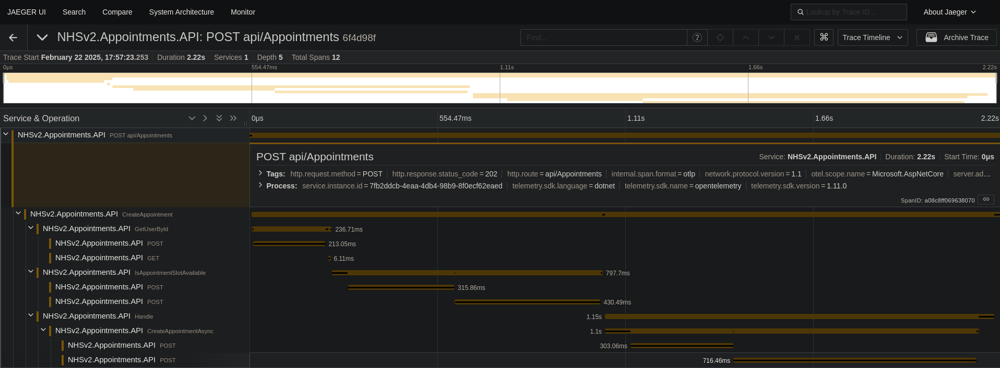
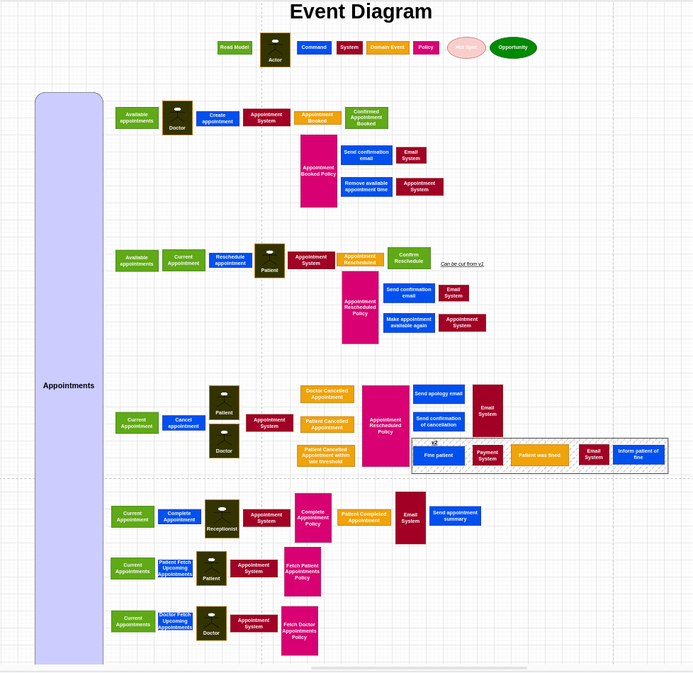
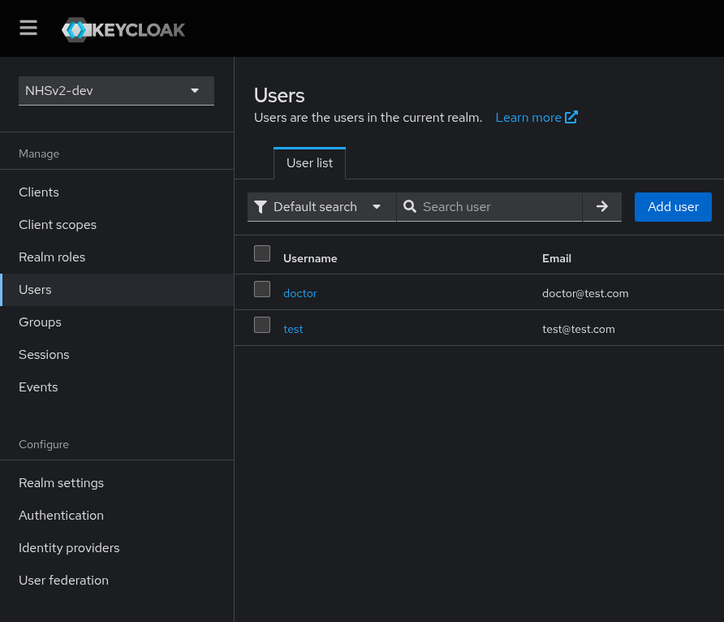

# NHSv2 Portfolio Project

## Overview

NHSv2 is my portfolio project, intentionally over-engineered to showcase my skills in software architecture and design. 
It is a simplified version of a system that manages appointments for a healthcare provider.
I got the inspiration from looking at something to improve on in the real world.

The project is a demonstration of several microservices design patterns.

The main technologies used by the project is **Event Sourcing** and **CQRS**. **EventStoreDB** and **MediatR** are the main libraries used to implement these patterns.
An **Ocelot API Gateway** is used to route requests to the appropriate microservice. **Keycloak** is the identity provider used for authentication and authorization.
"Clean Architecture" is loosely followed in the project structure. **Open Telemetry** and **Jaeger** are used for distributed tracing. **Redis** is used for caching and **RabbitMQ** is used for messaging between microservices. 

There is so much more work I could have done, I spent weekends and nights building this. 
The glaringly bad practices, like keys in source committed `appsettings.json`, hard coded credentials in the `docker-compose.yml`, are because this project is intentionally not meant for production.
This also explains the complete lack of tests, as I spent half my days writing tests at work, I don't fancy writing them at 10pm on a Thursday night for a project that won't get used.

## Project Structure

- `NHSv2.Gateway`: API gateway configuration using Ocelot.
- `NHSv2.Messaging`: Messaging contracts. This would be a Nuget package if all these microservices were correctly put into their own solutions.
- `NHSv2.Appointments`: Creating and reading Appointments.
    - `NHSv2.Appointments.EventStoreWorker`
- `NHSv2.Communications`: SendGrid email service.

## NHSv2.Appointments
The appointments microservice is capable of creating an appointment, and reading appointments for a facility. It uses Event Sourcing and CQRS to manage the state of appointments.
The EventStoreWorker listens for events from the EventStoreDB and updates the read model in the read-only Appointments SQL database.
The read model is stored in a Redis cache, flushed whenever a new appointment is created. Both endpoints are locked behind Keycloak authentication, requiring a Doctor role to access.

Google Calendar is used to create an event for the appointment. Ideally this would have been reflected in both the Patient's calendar and the Doctor's calendar. However, issues with the Google Calendar API prevented this from being implemented. (Domain-Wide Delegations of Authority.)

Event Sourcing patterns are followed, with Eventual Consistency between the read and write models. The read model is updated asynchronously by the EventStoreWorker. Upon a success, 
a message is sent to the Communications microservice, sending a confirmation email. A message is then sent back to the Appointments microservice to acknowledge this.

It does not have any capabilities for updating or deleting appointments, as this was not a requirement for the project. 

## Keycloak
Keycloak is used for authentication and authorization. I wrote some Medium articles about Keycloak a year before this project and wanted a chance to use it some more. 
For a real application I would have probably used IdentityServer4. There are Patient and Doctor roles. All users get a Patient role upon creation, but Doctor must be manually assigned.

## Key Components
- .NET
- EventStoreDB
- CQRS
- MediatR
- Ocelot
- Keycloak
- Open Telemetry
- Jaeger
- Redis
- RabbitMQ
- SendGrid
- Docker

## Running the Project

There are no instructions for running this project, as it was not written to be run by other people. It's simply a portfolio project.

### Screenshots

